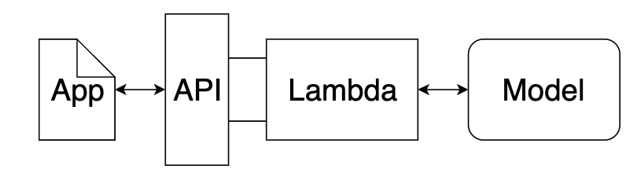

# Sentiment Analysis RNN Deployed Using AWS SageMaker

This repository contains a Sentiment Analysis Recurrent Neural Network (RNN) based on Long Short-Term Memory (LSTM) units which is deployed using [AWS SageMaker](https://aws.amazon.com/pm/sagemaker/). The result is simple public web app which interacts with the deployed endpoint to determine whether a movie review written by the user is positive or negative. In its present form, the project is intended to be executed using Amazon's SageMaker, but it could be easily ported to other deployment platforms.

The model is implemented with [Pytorch](https://pytorch.org/) and it uses materials from the [Udacity Deep Learning Nanodegree](https://www.udacity.com/course/deep-learning-nanodegree--nd101), which can be obtained in their original (non-implemented) form in [sagemaker-deployment](https://github.com/mxagar/sagemaker-deployment). That original repository, as well as the current one, serve as templates for similar projects.

Table of Contents:

- [Sentiment Analysis RNN Deployed Using AWS SageMaker](#sentiment-analysis-rnn-deployed-using-aws-sagemaker)
  - [How to Use This](#how-to-use-this)
    - [Overview of Files and Contents](#overview-of-files-and-contents)
    - [Git Interaction](#git-interaction)
    - [Dependencies](#dependencies)
    - [Model Integration](#model-integration)
    - [App Usage](#app-usage)
  - [Brief Notes on the Web App Architecture](#brief-notes-on-the-web-app-architecture)
  - [Brief Notes on AWS SageMaker](#brief-notes-on-aws-sagemaker)
  - [Brief Notes on LSTM-Based Neural Networks](#brief-notes-on-lstm-based-neural-networks)
  - [Improvements, Next Steps](#improvements-next-steps)
  - [Interesting Links](#interesting-links)
  - [Authorship](#authorship)

## How to Use This

The AWS SageMaker environment can be set up following these steps:

- Log in to the AWS console and go to the SageMaker dashboard.
- Click on 'Create notebook instance':
    - Choose a name, e.g.: `sentiment-rnn-deployment`
    - Instance type: `ml.t2.medium`; we can choose a more powerful one if we'd like to pay.
    - Elastic inference: none; no GPU acceleration needed for the notebook.
    - Platform identifier: Amazon Linux 2, Jupyter Lab 1.
    - Create a new IAM role with the following properties, if not available:
        - All SageMaker buckets should be accessible.
        - BUT: S3 buckets you specify: None.
        - Give/Enable root access to notebook.
    - No VPC.
    - Git repository: Clone a public repository: [https://github.com/mxagar/sentiment_rnn_aws_deployment.git](https://github.com/mxagar/sentiment_rnn_aws_deployment.git).
    - Rest of options: Default values are okay.
- Create the notebook.
- Start the notebook from the list of notebook instances; open JupyterLab.

:warning: AWS SageMaker charges the usage of it services if they're not in the free tier, thus, be careful to

- track any expenses in the AWS Billing dashboard
- and **turn off any unused services**.

Refer to [SageMaker Cleanup](https://docs.aws.amazon.com/sagemaker/latest/dg/ex1-cleanup.html) for more information on how to remove resources related a a project.

### Overview of Files and Contents

The project folder contains the following files:

```
.
├── Instructions.md                                   # Original instructions
├── LICENSE                                           # Original Udacity license
├── README.md                                         # This file
├── assets                                            # Images and auxiliary assets
│   └── web_app_architecture.jpg
└── src
    ├── README.md
    ├── SageMaker_Sentiment_Analysis_Project.ipynb    # Project notebook
    ├── Web_App_Diagram.svg
    ├── serve                                         # Files for deployment
    │   ├── model.py
    │   ├── predict.py
    │   ├── requirements.txt
    │   └── utils.py
    ├── train                                         # Files for model training
    │   ├── model.py
    │   ├── requirements.txt
    │   └── train.py
    └── website                                       # Web app HTML file
        └── index.html
```

The notebook [`SageMaker_Sentiment_Analysis_Project.ipynb`](src/SageMaker_Sentiment_Analysis_Project) is the main file which guides the complete model creation and its deployment.

### Git Interaction

:construction:

### Dependencies

Dependencies are resolved with the `requirements.txt` from [`train/`](train) and [`serve/`](serve).

### Model Integration

While AWS SageMaker has plenty of container images ready for specific models (e.g., XGBoost, Linear Learner, etc.), this project uses a Pytorch model which has custom scripts for its definition, training and inference. These scripts are located in the folders [`train/`](train) and [`serve/`](serve).

### App Usage

:construction:

## Brief Notes on the Web App Architecture

<p align="center">
  
</p>

:construction:

## Brief Notes on AWS SageMaker

:construction:

## Brief Notes on LSTM-Based Neural Networks

:construction:

## Improvements, Next Steps

:construction:

## Interesting Links

- [My notes and code](https://github.com/mxagar/deep_learning_udacity) on the [Udacity Deep Learning Nanodegree](https://www.udacity.com/course/deep-learning-nanodegree--nd101). A more detailed guide on AWS SageMaker can be found in the file [`DLND_Deployment.md`](https://github.com/mxagar/deep_learning_udacity/blob/main/06_Deployment/DLND_Deployment.md) from that repository.
- My on-going compilation of resources for [text sentiment analysis](https://github.com/mxagar/text_sentiment).
- More examples with RNNs using Pytorch: [Pytorch Guide](https://github.com/mxagar/deep_learning_udacity/blob/main/02_Pytorch_Guide/DL_Pytorch_Guide.md) (Section "Recursive Neural Networks").
- My [NLP Guide](https://github.com/mxagar/nlp_guide).
- [Understanding LSTM Networks, by Chris Olah](http://colah.github.io/posts/2015-08-Understanding-LSTMs/)
- [Exploring LSTMs, by Edwin Chen](http://blog.echen.me/2017/05/30/exploring-lstms/)
- [Karpathy's Lecture: Recurrent Neural Networks, Image Captioning, LSTM](https://www.youtube.com/watch?v=iX5V1WpxxkY)


## Authorship

Mikel Sagardia, 2022.  
No guarantees.

You are free to use this project, but please link it back to the original source.
