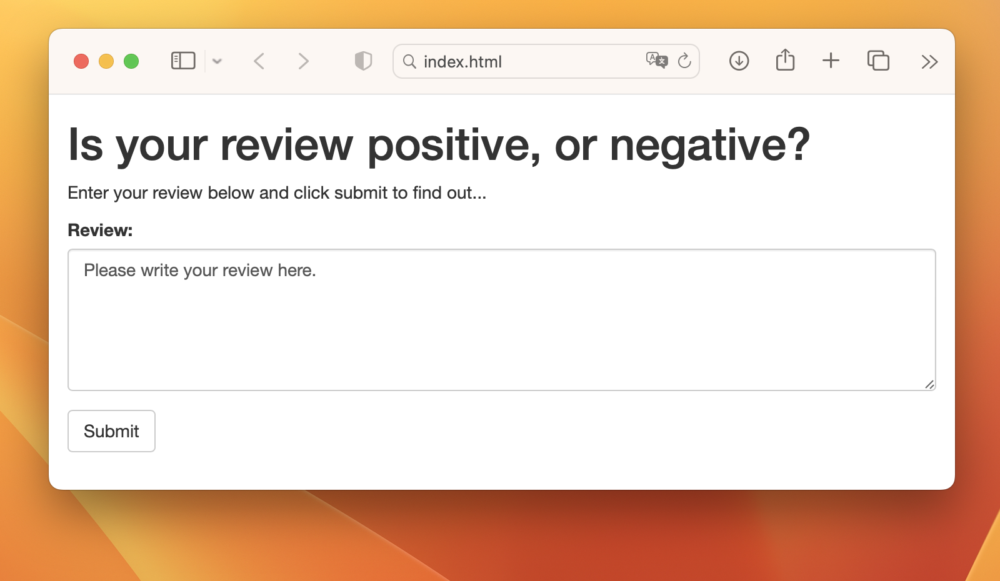
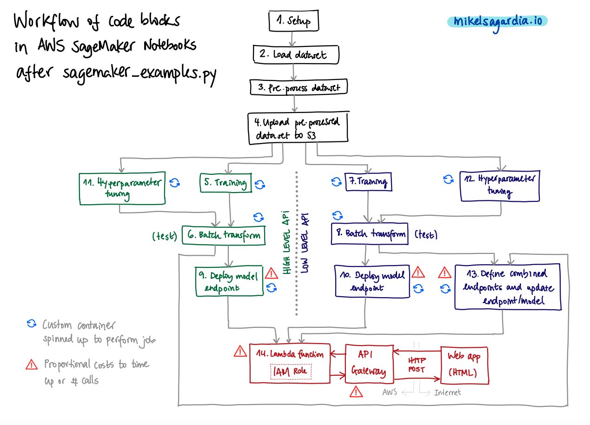
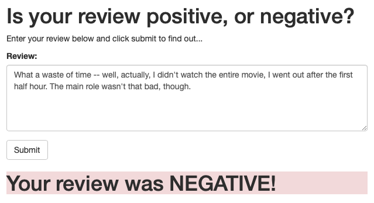
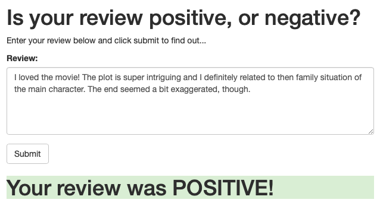
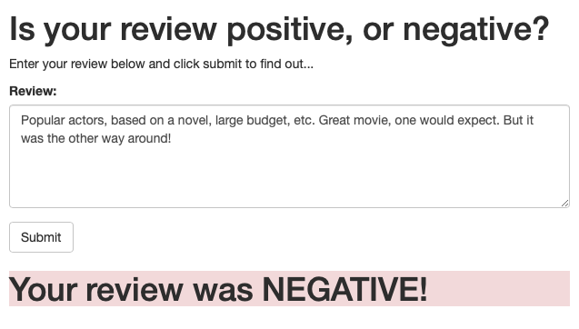
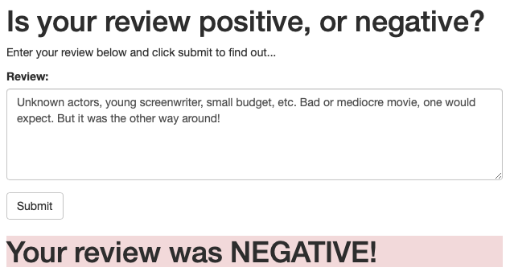

# Sentiment Analysis RNN Deployed Using AWS SageMaker

This repository contains a Sentiment Analysis Recurrent Neural Network (RNN) based on Long Short-Term Memory (LSTM) units which is deployed using [AWS SageMaker](https://aws.amazon.com/pm/sagemaker/). The result is simple public web app which interacts with the deployed endpoint to determine whether a movie review written by the user is positive or negative. In its present form, the project is intended to be executed using Amazon's SageMaker, but it could be easily ported to other deployment platforms.

The model is implemented with [Pytorch](https://pytorch.org/) and it uses materials from the [Udacity Deep Learning Nanodegree](https://www.udacity.com/course/deep-learning-nanodegree--nd101), which can be obtained in their original (non-implemented) form in [sagemaker-deployment](https://github.com/mxagar/sagemaker-deployment). That original repository, as well as the current one, serve as templates for similar projects.

The dataset used for training is the [IMDB dataset](http://ai.stanford.edu/~amaas/data/sentiment/):

> Maas, Andrew L., et al. [Learning Word Vectors for Sentiment Analysis](http://ai.stanford.edu/~amaas/data/sentiment/). In _Proceedings of the 49th Annual Meeting of the Association for Computational Linguistics: Human Language Technologies_. Association for Computational Linguistics, 2011.

Please note that **the project focuses on the deployment process/techniques rather than the model efficiency.**

Table of Contents:

- [Sentiment Analysis RNN Deployed Using AWS SageMaker](#sentiment-analysis-rnn-deployed-using-aws-sagemaker)
  - [How to Use This](#how-to-use-this)
    - [Overview of Files and Contents](#overview-of-files-and-contents)
    - [CLI and Git](#cli-and-git)
    - [Dependencies](#dependencies)
    - [Model Integration](#model-integration)
    - [App Usage](#app-usage)
  - [Brief Notes on the Web App Architecture](#brief-notes-on-the-web-app-architecture)
  - [Brief Notes on AWS SageMaker](#brief-notes-on-aws-sagemaker)
  - [Brief Notes on the Chosen Model](#brief-notes-on-the-chosen-model)
  - [Preliminary Results](#preliminary-results)
  - [Improvements, Next Steps](#improvements-next-steps)
  - [Interesting Links](#interesting-links)
  - [Authorship](#authorship)

## How to Use This

The AWS SageMaker environment can be set up following these steps:

- Log in to the AWS console and go to the SageMaker dashboard.
- Click on 'Create notebook instance':
    - Choose a name, e.g.: `sentiment-rnn-deployment`
    - Instance type: `ml.t2.medium`; we can choose a more powerful one if we'd like to pay.
    - Elastic inference: none; no GPU acceleration needed for the notebook.
    - Platform identifier: Amazon Linux 2, Jupyter Lab 1.
    - Create a new IAM role with the following properties, if not available:
        - All SageMaker buckets should be accessible.
        - BUT: S3 buckets you specify: None.
        - Give/Enable root access to notebook.
    - No VPC.
    - Git repository: Clone a public repository: [https://github.com/mxagar/sentiment_rnn_aws_deployment.git](https://github.com/mxagar/sentiment_rnn_aws_deployment.git).
    - Rest of options: Default values are okay.
- Create the notebook.
- Start the notebook from the list of notebook instances; open JupyterLab.

:warning: AWS SageMaker charges the usage of it services if they're not in the free tier, thus, be careful to

- track any expenses in the AWS Billing dashboard
- and **turn off any unused services**.

Refer to [SageMaker Cleanup](https://docs.aws.amazon.com/sagemaker/latest/dg/ex1-cleanup.html) for more information on how to remove resources related a a project.

### Overview of Files and Contents

The project folder contains the following files:

```
.
├── Instructions.md                                   # Original instructions
├── LICENSE                                           # Original Udacity license
├── README.md                                         # This file
├── assets                                            # Images and auxiliary assets
│   ├── sagemaker_examples.py                         # Exemplary code blocks for all step in SageMaker
│   └── sagemaker_examples_workflow.png               # Workflow diagram for the exemplary code blocks
└── src
    ├── README.md
    ├── SageMaker_Sentiment_Analysis_Project.ipynb    # Project notebook
    ├── Web_App_Diagram.svg
    ├── serve                                         # Files for deployment
    │   ├── model.py                                  # Model definition, derived from nn.Module
    │   ├── predict.py                                # Inference script, entry point for the container
    │   ├── requirements.txt                          # Dependencies installed in the deployment container
    │   └── utils.py
    ├── train                                         # Files for model training
    │   ├── model.py                                  # Same as in serve/
    │   ├── requirements.txt                          # Dependencies installed in the training container
    │   └── train.py                                  # Training script, entry point for the container
    └── website                                       # Web app HTML file
        ├── index.html
        ├── review_1.png                              # Example result 1
        ├── review_2.png
        ├── review_3.png
        └── review_4.png
```

The notebook [`SageMaker_Sentiment_Analysis_Project.ipynb`](src/SageMaker_Sentiment_Analysis_Project) is the main file which guides the complete model creation and its deployment.

When that main notebook is run, the folders `data` and `cache` appear in the root project directory; these folders contain the downloaded dataset and generated artifacts/object, such as the created word dictionary.

### CLI and Git

In the notebook instance, we can open a Terminal with the launcher, which gives us access to the EC2 instance on which the notebook is running:

```bash
pwd # /home/ec2-user
cd SageMaker
ll
# sentiment_rnn_aws_deployment # the repo cloned via the GUI
# lost+found
```

There are several ways to push/pull to repositories that were cloned with their HTTPS version; I use **Personal Access Tokens**. Steps to set up a token credential:

- Create a token on Github: Github Settings > Developer Settings > Personal Access Token: Create.
- In the notebook instance terminal, set user account and activate credential storing:

```bash
# Open Terminal and set user account
git config --global user.email "my@email.com"
git config --global user.name "my_username"

# Activate credential storing to local file
# If we use 
#   credendial.helper cache
# instead of
#   credendial.helper store
# the credential (token) is saved to memory
git config --global credential.helper store

git pull

# Edit something
git add .
git commit -m "message"
git push
# Input
# - username
# - pw: token

# Check that the credential is there!
# If we chose 'store', it should be there
less ~/.git-credentials
```

Later on, to push, either do it in the Terminal, or using the GUI: left menu panel, Git icon.

Note that with the option `credendial.helper store` a file is stored with our credentials, without encryption!

More information:

- [Pushing to HTTPS repositories](https://repost.aws/questions/QU-P1Hlk4OR6K6kAug-wHT_g/can-sagemaker-git-repositories-use-ssh-secrets-no-name-and-password)
- [Git Credentials Storage](https://git-scm.com/book/en/v2/Git-Tools-Credential-Storage)

### Dependencies

Dependencies are resolved with the `requirements.txt` from [`src/train/`](src/train) and [`src/serve/`](src/serve). Additionally, SageMaker is already set up to use the main notebook.

### Model Integration

While AWS SageMaker has plenty of container images ready for specific models (e.g., XGBoost, Linear Learner, etc.), this project uses a Pytorch model which has custom scripts for its definition, training and inference. These scripts are located in the folders [`src/train/`](train) and [`src/serve/`](src/serve).

In particular:

- The model definition is done is `model.py`, which is copied in both [`src/train/`](src/train) and [`src/serve/`](src/serve).
- The folder [`src/train/`](src/train) contains the training script [`src/train/train.py`](src/train/train.py), which is the entry point for the training container.
- The folder [`src/serve/`](src/src/serve) contains the training script [`src/serve/predict.py`](src/serve/predict.py), which is the entry point for the inference container that is deployed.

All the details are explained in the main notebook.

### App Usage

In order to use the app, we need to have:

- All the cells in the main notebook executed (except the deletion of the deployment endpoints, at the end).
- A Lambda function deployed, as explained in the notebook.
- An API Gateway created, as explained in the notebook.
- The API Gateway URL correctly specified in the [`src/website/index.html`](src/website/index.html) file.

Once all is set up, we can locally open the [`src/website/index.html`](src/website/index.html) app with our local browser and we'll the following input field ready to use:

<p align="center">
  
</p>


## Brief Notes on the Web App Architecture

AWS models are deployed as containers that have endpoints waiting for requests. We can even deploy several models behind the same endpoint and the container itself routes the requests to the different models. However, those endpoints are only accessible by AWS authenticated services, i.e., we cannot use them directly over the internet without additional layers of processing.

Therefore, the usual solution, and the one adopted here, consists in using an **API Gateway** combined with a **Lambda function**. The resulting architecture is schematically depicted below, and the list of steps taken to  score a review are the following:

- The user submits a review in plain text to the publicly reachable API Gateway, which is a REST API.
- The API catches the request (i.e., the review to be evaluated) and triggers a Lambda function, passing to it the review.
- The Lambda function connects to the model endpoint and requests a scoring; it waits for the inferred value, and sends it back to the API Gateway.
- The API Gateway packs the score as an HTML response and delivers it to the user.

<p align="center">
  
</p>

Note that the user interacts with a simple GUI implemented in an HTML form; however, the API Gateway can be interfaced by any system that speaks HTTP methods, since it's in reality a REST API.

Lambda functions have become extremely popular in cloud computing, since they allow *serverless* simple processings or interactions with a backend. That means we don't need to spin up a container / VM / server to execute the code in the lambda function, it is executed for the user seamlessly &mdash; of course, there's a server running behind, but we don't care about setting it up.

## Brief Notes on AWS SageMaker

[AWS SageMaker](https://aws.amazon.com/pm/sagemaker/) is a cloud service by Amazon which enables the execution of all the major steps in a machine learning application hosted at AWS: (1) exploration and data processing, (2) modeling and (3) deployment. SageMaker is composed by three major elements:

- SageMaker Studio
- Notebook instances
- The SageMaker API

The SageMaker Studio is basically an IDE based on Jupyter Labs notebooks with additional Amazon extensions and plugins. However, this project still uses regular notebook instances.

SageMaker works in such a way that dedicated containers are started via the API for training, testing and deploying models. The results or operation information (i.e., logs) of those containers can be consulted in the AWS console. Additionally, the datasets used for training as well as the generated artifacts are stored in S3 buckets. Depending on the degree of control we'd like for each container-task definition, we can use the so called *high level* or *low level* APIs.

The file [`assets/sagemaker_examples.py`](assets/sagemaker_examples.py) contains code blocks that can be re-used to build an application as the one defined and deployed in this repository; the following diagram shows how the different code blocks are related:

<p align="center">
  
</p>

However, note that:

- These code blocks are barely explained in the script, i.e., they're intended for the user who knows what's going on but in need for the correct API call with context; if you'd like to have a more detailed guide on AWS SageMaker, I suggest checking my notes in the file [`DLND_Deployment.md`](https://github.com/mxagar/deep_learning_udacity/blob/main/06_Deployment/DLND_Deployment.md).
- The workflow and file constellation used in the present repository are somewhat different to the one used in the exemplary code blocks, because the project defines, trains and deploys a custom Pytorch model. That requires creating custom containers with manually defined entry points or executed scripts. The differences and the required approach are detailed in the project notebook.

## Brief Notes on the Chosen Model

Sentiment analysis models have difficulties with irony and sarcasm, word ambiguity, or when previous sentences are negated, among other challenges. For these cases a model that works with sequences is probably better suited than one that scores bags of words, because decisive nuances often can be captured from the word sequence as a whole (i.e., the text), but not observing the individual scrambled words alone.

The model chosen for the sentiment classification is a Recurrent Neural Network (RNN) based on Long Short-Term Memory (LSTM) units. These networks are particularly efficient at modeling long sequences of vectors. More information on the text pre-processing which is necessary and how these models work is provided in my repository [text_sentiment](https://github.com/mxagar/text_sentiment).

However, it is worth noting that gradient boosting models (e.g., XGBoost) or tree-based models (e.g., random forests) often outperform neural networks with tabular data. One could consider a text vectorized as a bag of words to be a tabular data point. Also, consider the fact that the majority of the reviews have a straightforward style, thus, observing the valence/sentiment value of the words used in them should lead to enough information on the overall sentiment of the text.

Finally, we should take into account that neural networks require larger corpora than the one used in this project in order to become really efficient.

All in all, the focus of this project lies more on the techniques used for deployment on AWS SageMaker rather than defining an efficient model.

## Preliminary Results

The model seems to work nicely with easy reviews where no irony or meaning changes are conveyed. In contrast, when those properties are introduced, it starts to fail. However, note that **the focus of the project lies on the AWS deployment**, rather than on the efficiency of the network.

Some examples:

<p align="center">
  
</p>

<p align="center">
  
</p>

<p align="center">
  
</p>

<p align="center">
  
</p>

## Improvements, Next Steps

- [ ] Improve the html web app.
- [ ] Improve the model: try more layers; train longer; get a bigger dataset.
- [ ] Test more thoroughly irony an sarcasm.
- [ ] Use AWS SageMaker Studio instead of the notebook instances.
- [ ] Upgrade the required SageMaker version (to V2).

## Interesting Links

- [My notes and code](https://github.com/mxagar/deep_learning_udacity) on the [Udacity Deep Learning Nanodegree](https://www.udacity.com/course/deep-learning-nanodegree--nd101). A more detailed guide on AWS SageMaker can be found in the file [`DLND_Deployment.md`](https://github.com/mxagar/deep_learning_udacity/blob/main/06_Deployment/DLND_Deployment.md) from that repository.
- Tutorial on how to use AWS SageMaker: [sagemaker-deployment](https://github.com/mxagar/sagemaker-deployment).
- My on-going compilation of resources for [text sentiment analysis](https://github.com/mxagar/text_sentiment), with related text pre-processing and model explanations.
- More examples with RNNs using Pytorch: [Pytorch Guide](https://github.com/mxagar/deep_learning_udacity/blob/main/02_Pytorch_Guide/DL_Pytorch_Guide.md) (Section "Recursive Neural Networks").
- My [NLP Guide](https://github.com/mxagar/nlp_guide).
- [Understanding LSTM Networks, by Chris Olah](http://colah.github.io/posts/2015-08-Understanding-LSTMs/)
- [Exploring LSTMs, by Edwin Chen](http://blog.echen.me/2017/05/30/exploring-lstms/)
- [Karpathy's Lecture: Recurrent Neural Networks, Image Captioning, LSTM](https://www.youtube.com/watch?v=iX5V1WpxxkY)
- [Using Docker containers with SageMaker](https://docs.aws.amazon.com/sagemaker/latest/dg/docker-containers.html).


## Authorship

Mikel Sagardia, 2022.  
No guarantees.

You are free to use this project, but please link it back to the original source.
